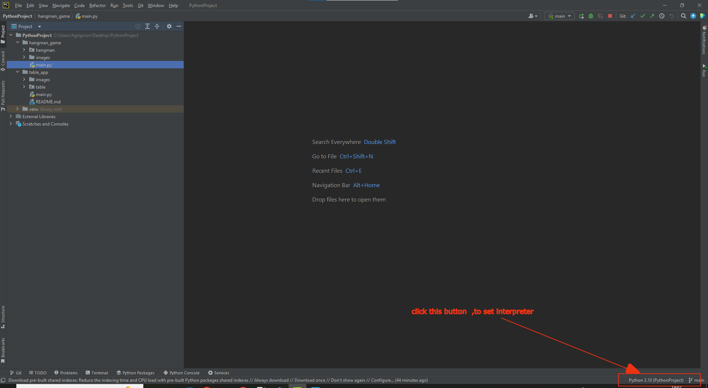

# Hangman
***
***
### Hangman is a guessing game, in which the player tries to guess a word by
### suggesting letters within a certain number of guesses .
***
***
## How to play :
***
### after player write his name , chose difficulty and category , he
### can choose to see or not list of all wrong letters.
### When game start , player make suggestion for letter or whole word,
### the max errors that he can make is tne number ot letters in word
### if letter is in hidden word the player will see it ,
### otherwise the numbers of errors will decrease with 1.
### when player guess whole hidden word  - he won ,
### if the errors ends  -  lose.
### After win , player`s HIL_points increase with 1.
***
### In gameplay, player have special commands that can use :
***
* @difficulty - change difficulty 
* @category - change category
* @try -  make additional try / each additional try will coast 10 HIL points /
* @hint - take hint / each hint used will subtract 2 from the errors score /
* @stop - stop game
* @exit - exit game
***
***
## How to Start Game
***
### you must have Python 3.10 (or higher version) , Git and PyCharm installed on your device.
###
***
1. Go to repository page
2. Click on Code button
3. Click on HTTPS button
4. Copy link

5. Open PyCharm -> Projects
6. Click on Get from VCS
7. Paste link
8. Select directory
9. Click Clone

10. Open folder hangman_game
11. Select and RUN main.py

    1.If you have message ERROR for , you must set your local interpreter

    2.Make next steps

    3.Now select and RUN main.py
12. Prepare to play
    
    1.Enter your name

    2.Choose difficulty
    
    3.Choose category

    4.Make decision for wrong letters 

13. Start play hangman

